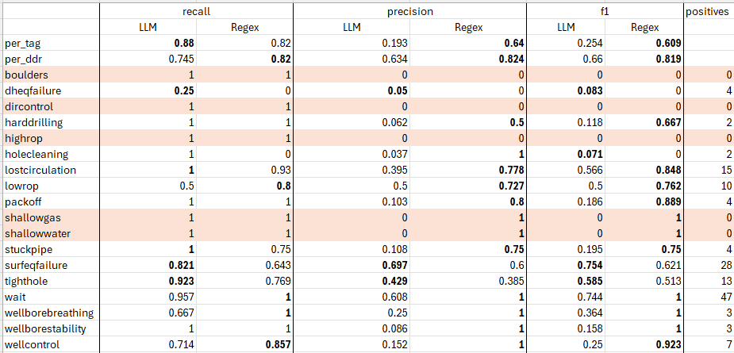

# LLM Performance

This document is not an experiment but just an analysis of the current
performance of the model.

## Execution

We took the code from main and ran the inference flow (`tag_record`),
followed by the evaluation flow.
The two runs are stored on AzureML:

- [inference run](https://ml.azure.com/prompts/bulkrun/run_20241204100014/details?wsid=/subscriptions/d6c4788f-bcf7-4967-9394-a358fb808e44/resourcegroups/akerbp-ai-dev/providers/Microsoft.MachineLearningServices/workspaces/mlw-dev-akerbpai&tid=1946e150-fcb1-48f1-a88d-9796a7502178)
- [evaluation run](https://ml.azure.com/prompts/bulkrun/eval_20241204100014/details?wsid=/subscriptions/d6c4788f-bcf7-4967-9394-a358fb808e44/resourcegroups/akerbp-ai-dev/providers/Microsoft.MachineLearningServices/workspaces/mlw-dev-akerbpai&tid=1946e150-fcb1-48f1-a88d-9796a7502178)

To see the metrics, please look at the evaluation run.

## Results

Here is a comparison of the LLM performance against the incumbent regex
method with metrics reported for each tag.
In bold we can see where one model is better than the other.
The column *positives* reports how many tags we have in the ground truth
dataset for a given tag. We can see that some of them are not present in the
dataset, and for those tags we highlighted the row in light red.



### Overall performance

The aggregated values `per_tag` and `per_ddr` are computed as averages of the
three metrics (precision, recall, f1) over the dataset by aggregating on the
tags or on the DDR respectively.
These numbers are informative but only give a rough idea on which model
performs better than the other. They suffer of a few caveats for which we need
to dig deeper into the performance of each tag to get the complete picture.

The main problem is that some tags can either be present in big numbers in
the dataset, not be present at all, or be present but just for a few records.
This makes the average a bit unreliable due to the different distributions.

Nevertheless, we can see a pattern where the LLM seems to perform better
on recall and worse on precision. Unfortunately, the recall is not good
enough make the F1 score better for the LLM in any of the aggregated metrics.

The good recall performance of the LLM can be seen in the breakdown by
tag. It is somewhat promising that for some tags (`dheqfailure`,
`surfeqfailure`, `tighthole`) the high recall is accompanied also by good
precision. In other cases (`holecleaning`, `lostcirculation`, `packoff`,
`shallowgas`, `shallowwater`, `stuckpipe`, `wellborestability`,
`wellcontrol`) the high recall translates into very low precision.

There are few tags (`wait`, `wellborebreathing`, `wellborestability`) for
which the regex algorithm has perfect results. The LLM is nowhere close to
the regex performance for those tags.

To sum up, by looking at the breadown by tag, we believe that we can already
draw some conclusions.
The regex is a clear winner for the following tags:

- `wait`
- `wellborebreathing`

The reason why the regex scores perfectly on `wait` is very simple.
It seems that whenever the operation sub-code is either `WAIT` or `WOW`, then
the `wait` tag should be applied. The regex rule is literally just checking
the operation sub-code for this tag, which apparently is the right thing to
do.

On the other hand, the LLM is better for:

- `surfeqfailure`
- `tighthole`

Other tags either do not appear often enough as positives in the dataset, or
neither of the two models obtains much better recall and precision.

## Error Analysis

We now pick few examples where the LLM does not assign the correct tag, and
try to group them into reasons why the assignment is incorrect.

### LLM overcautious

#### OC: First example

```json
{
  "inputs.text": "(202) B/reamed and circulated with 930 gpm, 2600psi, 112/100 rpm up/down, 10-12 kftlbs, 12,97-12,85 PPG ECD. Shakers coping with cuttings load for the most part. Another 50 psi pressure drop observed, amounting to a total of 350 psi pressure drop from 02:00 hrs.",
  "inputs.phase": "INT1",
  "inputs.operationSubcode": "CIR",
  "inputs.assigned_tags": [
    "lostcirculation",
    "wellcontrol",
    "holecleaning",
    "packoff"
  ],
  "inputs.prediction": [
    {
      "tag": "lostcirculation",
      "present": true,
      "justification": "The report mentions a pressure drop of 350 psi, which could indicate potential lost circulation if the pressure inside the wellbore is higher than the formation strength."
    },
    {
      "tag": "wellcontrol",
      "present": true,
      "justification": "The pressure drop could indicate potential well control issues, especially if it is related to unplanned inflow of fluids."
    },
    {
      "tag": "holecleaning",
      "present": true,
      "justification": "The shakers are coping with cuttings load, which suggests that there may be challenges in effectively removing cuttings from the wellbore."
    },
    {
      "tag": "packoff",
      "present": true,
      "justification": "The mention of shakers coping with cuttings load could indicate a potential pack-off situation if circulation is restricted."
    }
  ],
  "inputs.groundtruth": "['holecleaning']"
}
```

Here, the LLM assigns four tags, whereas only one of these is correct,
according to the ground truth.

It is not clear if `lostcirculation` and `wellcontrol` are wrongly assigned
or maybe the LLM is overcautious.
At the best of our knowledge, the LLM is being overcautious in tagging
`packoff`.

#### OC: Second example

```json
{
  "inputs.text": "POOH DRILL STRING  NO PENETRATION Tight spot at 2905 m,connected TDS and back reamed the tight spot (free above 2900 m)",
  "inputs.phase": "drilling",
  "inputs.operationSubcode": "",
  "inputs.assigned_tags": [
    "harddrilling",
    "wellborestability",
    "stuckpipe",
    "packoff",
    "dircontrol",
    "tighthole"
  ],
  "inputs.prediction": [
    {
      "tag": "harddrilling",
      "present": true,
      "justification": "The report indicates a tight spot at 2905 m, which suggests difficulty in maintaining control over drilling parameters."
    },
    {
      "tag": "wellborestability",
      "present": true,
      "justification": "The presence of a tight spot may indicate potential issues with wellbore stability, such as collapse or enlargement."
    },
    {
      "tag": "stuckpipe",
      "present": true,
      "justification": "The report mentions a tight spot, which can lead to the drill string becoming immobilized."
    },
    {
      "tag": "packoff",
      "present": true,
      "justification": "The tight spot could indicate an accumulation of cuttings around the drill string, leading to potential pack-off."
    },
    {
      "tag": "dircontrol",
      "present": true,
      "justification": "The mention of a tight spot suggests difficulties in maintaining or achieving the planned well trajectory."
    },
    {
      "tag": "tighthole",
      "present": true,
      "justification": "The report explicitly mentions a tight spot, indicating reduced wellbore diameter causing difficulties."
    }
  ],
  "inputs.groundtruth": "['tighthole']"
}
```

Again the LLM assigns many tags, of which only one should be there according
to the ground truth.
We can see from the justifications that the LLM leans toward assigning a tag
if it is unsure. For example, in `wellborestability` we see that the LLM say
that a tight spot *might* indicate potential issues with wellbore stability.
Another example is the `stuckpipe` justification. The tight spot *can* lead
to the drill string becoming immobilized.

### Potential problems in ground truth or in data

#### GT: First example

```json
{
  "inputs.text": "POOH with 8 1/2\" Drill out BHA on 5\" DP from 1571 m to 1287 m. -Ok  Meanwhile: Start mixing spacer. Unable to start earlier due to one mix line waiting on repair.",
  "inputs.phase": "ABAN",
  "inputs.operationSubcode": "POH",
  "inputs.assigned_tags": [
    "wait",
    "surfeqfailure"
  ],
  "inputs.prediction": [
    {
    {
      "tag": "wait",
      "present": true,
      "justification": "There is an unplanned delay due to one mix line waiting on repair."
    },
    {
      "tag": "surfeqfailure",
      "present": true,
      "justification": "The inability to start earlier is due to a repair needed on a mix line, indicating surface equipment failure."
    }
  ],
  "inputs.groundtruth": "['surfeqfailure']"
}
```

Here the LLM gives two tags, one is correct and the other is not.
If we take the definition of `wait`:

> Unplanned delays or waiting periods during drilling operations. Typically waiting on weather or waiting for production to shut down neighbouring wells. Could also be related to waiting for equipment or personnel.

One could argue that the LLM is being overcautious and its interpreting the
inability to start earlier to an unplanned delay. Adhering perfectly to the
definition of `wait` provided in the prompt.

### Very short text or missing instructions

#### MI: First example

```json
{
  "inputs.text": "Flowchecked well 10 min,- neg.",
  "inputs.phase": "PROD1",
  "inputs.operationSubcode": "WELCON",
  "inputs.assigned_tags": [],
  "inputs.prediction": [
    {
      "tag": "wellcontrol",
      "present": false,
      "justification": "The report does not indicate any unplanned inflow of fluids or well control issues."
    }
  ],
  "inputs.groundtruth": "['wellcontrol']"
}
```

The LLM just looks at the text to perform the classification and it seems
there's not enough information to classify as `wellcontrol`.
In fact, the justification the SME gave for assigning the tag hints to look
at the operationSubcode field:

> Code: WELCON

#### MI: Second example

```json
{
  "inputs.text": "Took weight at 5661-5662 m. Set down 35 mt. Picked up. Had 25 ton overpull. Worked down to 5664 m with 30-40 tons. Picked up to 5656 m. \nReamed stand slowly down 30 rpm, 22 kftlbs. Very little restriction seen when rotating.",
  "inputs.phase": "RUNPRD",
  "inputs.operationSubcode": "WRKPIP",
  "inputs.assigned_tags": [
    "stuckpipe"
  ],
  "inputs.prediction": [
    {
      "tag": "stuckpipe",
      "present": true,
      "justification": "The report mentions overpull and working down, which could indicate potential stuck pipe issues."
    },
    {
      "tag": "tighthole",
      "present": false,
      "justification": "There is no mention of lubrication issues or reduced wellbore diameter."
    }
  ],
  "inputs.groundtruth": "['tighthole']"
}
```

LLM is overcautious in assigning `stuckpipe` ([..] *could indicate
potential* [...]), but it is not able to recognize took weight, overpull and
working of strings as indication of `tighthole`.
See the SME justification for assigning the tag:

> Took weight, overpull and working of string indicates tight hole challnges.

And the definition of `tighthole`:

> Use of lubrication indicates tighthole issues. Reduced wellbore diameter causing difficulties in running tools or casing. The reason for this can be wellbore stability or geometrical challenges in the trajectory. It could also be due to mechanical issues where large equipment is ran into a small hole.

The justification of the SME does not seem to be covered in the definition.

#### MI: Third example

```json
{
  "inputs.text": "Hanging up in upper SPM. Increase speed to 15 m/min to get past.",
  "inputs.phase": "INTERV",
  "inputs.operationSubcode": "GLVLV",
  "inputs.assigned_tags": [
    "harddrilling",
    "stuckpipe",
    "highrop"
  ],
  "inputs.prediction": [
    {
      "tag": "harddrilling",
      "present": true,
      "justification": "The mention of 'Hanging up' suggests difficulties in maintaining control over drilling parameters, which is indicative of hard drilling."
    },
    {
      "tag": "stuckpipe",
      "present": true,
      "justification": "The term 'Hanging up' implies that the drill string may be stuck, which is a direct indication of a stuck pipe situation."
    },
    {
      "tag": "highrop",
      "present": true,
      "justification": "Increasing speed to 15 m/min suggests a high rate of penetration, which could lead to issues if not managed properly."
    }
  ],
  "inputs.groundtruth": "[]"
}
```

The tags `stuckpipe` and `harddrilling` are potentially assigned because
of an overcautious LLM.
However, for `highrop` the LLM does not take into account that we are dealing
with an intervention (phase: `INTERV`), and not with drilling.
Therefore, the issue is that we did not instruct that high ROP cannot happen
here.

### LLM just wrong

#### JW: First example

```json
{
  "inputs.text": "Secured 13 3/8\" Casing Fish in rotary table. Released spear by bleeding off the jar with low weight. Pulled out of fish. Retracted DDM and laid down fish with single joint elevators.\n\nHeld D1 kick drill with Spear released from fish. Latched Single joint elevators and prepared to pull fish above BSR.",
  "inputs.phase": "ABAN",
  "inputs.operationSubcode": "LD",
  "inputs.assigned_tags": [
    "wellcontrol"
  ],
  "inputs.prediction": [
    ...
    {
      "tag": "wellcontrol",
      "present": true,
      "justification": "The mention of a kick drill suggests that there are well control measures being taken, indicating a potential risk."
    },
    ...
  ],
  "inputs.groundtruth": "[]"
}
```

Here is the definition of `wellcontrol` we provide to the LLM in the prompt
(bold added by the author):

> Managing formation pressures to prevent kicks or blowouts. Caused by unplanned inflow of fluids into the borehole. Can cause kick, blowout. Very often detected by gain in fluid levels on surface (”pit gain”). Note that there are regular kick drills reported. **A Kick drill should not be tagged**, this is a planned routine that the drill crew needs to do on a regular basis. Building and setting back a kick stand should not be tagged. This is a contingency equipment prepared on the rig floor before drilling.

We can see that the LLM does not "listen" to the definition and still defines
the record as `wellcontrol`.

#### JW: Second example

```json
{
  "inputs.text": "Attempted to pressure test 20” casing and cement plug in Seal 2 against BSR to 300 psi - No go. Meanwhile hydraulic mechanics conducted 3m + 6m PM on Main HR\n",
  "inputs.phase": "ABAN",
  "inputs.operationSubcode": "TSTPRS",
  "inputs.assigned_tags": [],
  "inputs.prediction": [
    {
      "tag": "dheqfailure",
      "present": false,
      "justification": "There is no mention of malfunction or breakdown of downhole equipment."
    }
  ],
  "inputs.groundtruth": "['dheqfailure']"
}
```

The LLM is not able to recognize that the pressure test failed indicating a
malfunction.

## Recommendation

By looking at the error analysis and the different reasons why the tag
assignment is incorrect, we can make some recommendations to improve the
model and the ground truth.

### First recommendation

It seems that the LLM is assigning more tags than required. This translates
in very low figures for precision. However, we believe that this is expected
behavior. In fact, we instruct the LLM as follows:

> In case of a doubt about a risk, prefer marking it as **"yes"** rather than "no" to avoid missing potential risks.

Therefore, if we want to increase precision, we might want to remove this
line and see the effect on the metrics. However, we have to be careful that
we do not have a drop in recall.
This calls for an experiment.

### Second recommendation

Some instruction does not seem to be covered in the prompt. We should
potentially include these. For example, the importance of the sub-code for
the wait tag (the regex is always correct because it only looks at the code
to do the assignment, see `wait`), or being more explicit.

These might be relevant if we want to focus on a tag by tag basis to boost
the LLM performance.
The recommendation is to do an extensive analysis of the cases where the LLM
is wrong for a particular tag and see what we can do in the prompt to improve
the metrics.

Other experiments might cover additional logic for which some risks can only
happen in particular `phases` or `sub-codes`.

### Third recommendation

There are few tags for which we do not have samples in the ground truth
dataset. We should increase the size of the dataset to cover also those
cases and get more cases for the tags that are now below 10.

### Fourth recommendation

Assigning tags is a subjective task. We believe that two engineers tasked
with tagging the same DDR might provide different tags.
For this reason, we recommend to ask another SME to perform the tagging of
the dataset to see where are the DDRs that are more ambiguous. Obviously, if
two SMEs disagree on a given DDR, we expect the tag to be highly subjective
and potentially we should penalize less the LLM if it's tagging it wrongly.
