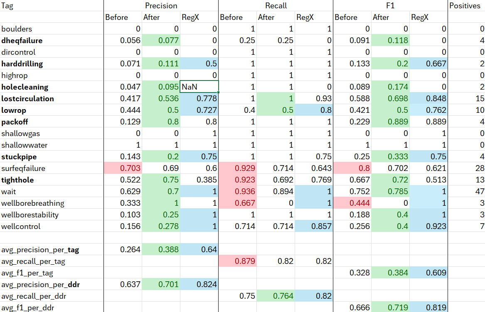

# Modify prompt to improve precision metrics

## Experiment Summary

### Hypothesis

Currently, the LLM assigns numerous tags, which yields high recall but results in very low precision. In the existing prompt, the LLM is instructed with the following directive:

> In case of a doubt about a risk, prefer marking it as **"yes"** rather than "no" to avoid missing potential risks.Instruction string: "In case of a doubt about a risk, prefer marking it as **"yes"** rather than "no" to avoid missing potential risks."

We hypothesize that by removing this instruction string from the prompt, the precision of tag assignments will improve. It is anticipated that recall may decrease as a result, and the experiment aims to evaluate the extent of this change in recall

### Impact

If proven True:
By increasing the precision, we get less false postive hits causing less tags to be displayed in the Offset well analyzre UI. This will allow drilling engineers to focus on more meaningful and accurate information. (do not look at false tags)

If proven False:
If precision does not significantly improve, or if the decrease in recall is substantial, drilling engineers may miss critical risks due to fewer tags being assigned.
This could compromise the effectiveness of risk identification and management processes.

### Measure of Success

Success will be measured by comparing precision and recall metrics before and after modifying the prompt. Each tag will be individually examined and evaluated to assess changes in these metrics. Specifically, the experiment seeks to achieve a substantial increase in precision without causing a significant decline in recall.

The criteria for success are as follows:
Precision: A considerable improvement compared to the baseline.
Recall: A minimal decrease, ensuring that essential risks are still identified.
This branch will only be merged with the main (deployed) model if precision increases markedly while recall does not decrease appreciably.

### Dependencies

No dependencies

## Methodology

### Initial Plan

To execute this experiment follow the steps:

1. Run the original flow
1. Change the prompt by removing instruction string: `3. In case of a doubt about a risk, prefer marking it as **"yes"** rather than "no" to avoid missing potential risks.`
1. Run the flow again
1. Compare the performance metrics before and after.
1. Write conclusion

### Assumptions and Limitations

Assumptions:The ground truth dataset accurately represents the range of potential risks. Removing the instruction string will primarily affect precision and recall without introducing other unintended biases.
Limitations: Sample Size, The ground truth sample size is limited, which may affect the generalizability of the results. A small sample may not capture the full diversity of potential risks, leading to results that might not reflect real-world performance accurately.
Mitigation Strategy: Redo the experiment with larger and more diverse ground truth datasets to validate the findings and ensure they are representative of actual performance.

### Data specifications

The experiment employs the entire ground truth dataset to ensure comprehensive coverage of potential risks.
Preprocessing: No additional pre-processing steps are applied to the dataset beyond standard data validation to ensure data integrity and consistency
Link to data set: `data/risk-tagging/reviewed_distributed_ddr_v5.csv`

## Execution

### Execution Details

Executed the experiment with existing tools. Ran promptflow in ml azure.
The experiment was conducted using the existing tools without any alterations to the initial methodology. Specifically, PromptFlow was executed within the Azure Machine Learning environment as planned.

## Results

Learnings and Future Implications: The successful execution within Azure Machine Learning confirms the compatibility and reliability of the current toolset for similar experiments. Future experiments can leverage this setup.

Color coding:

1. Red: the old prompt shows best metrics
1. Green: the new prompt shows best metrics
1. Blue: regex shows best metric

Precision and Recall Improvements: For the majority of tags, the new prompt demonstrated increased precision without a substantial decrease in recall. This improvement indicates that the LLM is generating fewer false positives, thereby enhancing the overall accuracy of tag assignments.

1. dheqfailure*
1. harddrilling*
1. holecleaning*
1. lostcirculation
1. lowrop
1. packoff*
1. stuckpipe*
1. wait
1. wellcontrol*

* less than 10 samples

Tags with Zero Hits: Several tags recorded zero hits in the dataset. As a result, no definitive conclusions can be drawn regarding the performance of the new prompt for these specific tags.

1. boulders
1. dircontrol
1. highrop
1. shallowgas
1. shallowwater

Tags which needs futher investigation, to improve metrics.

1. tighthole: improved precision at the expense of lower recall.
1. surfeqfailure: all metrics decreased with the new prompt.

Even though the new prompt shows better metrics, the regex algorithm still performs better on some tags.
Comparison with regex: Despite the overall better performance of the new prompt, regex continue to outperform the LLM for certain tags. This indicates that while the prompt modification increased the performance for some tags, regex may still be better for detecting certain tags.

1. wait
1. wellborebreathing
1. wellborestability
1. wellcontrol
1. lowrope
1. harddrilling

### Results Summary

{What were the concrete results of the experiment? How do those results compare to your expectations? Was this a success or a failure?}

Results can be seen in: `akerbp-ai\experiments\2024-10-12-modify-prompt-to-improve-tagging-precision\summary_metrics.xlsx`

The results indicate improved precision for most tags, suggesting a reduction in false positive. However, the dataset does not contain all possible tags, which may skew the average metrics and limit the generalizability of the findings. Consequently, definitive conclusions cannot be drawn from this experiment alone, and further investigation is necessary to validate and extend these results.

Recommended Further Studies

1. Expand the dataset: Rerun the experiment using a larger and more comprehensive dataset. A more extensive ground truth sample will provide a better representation of the LLM's performance across a wider range of tags, strengthens the reliability of the results.
1. Develop and perform new experiments that investigate different prompt configurations for different tags. The current metrics suggest that no single prompt configuration can achieve high precision across all tags. Exploring multiple prompts may help identify configurations that optimize performance for specific subsets of tags.

Given the mixed results and the limitations of the current dataset, the proposed prompt modification should not be merged into the main branch.
It is advisable to conduct the recommended further studies to ensure that the changes lead to meaningful and consistent improvements.

### Results References

* [Baseline evaluation run](https://ml.azure.com/prompts/bulkrun/eval_run_20241210141056/details?wsid=/subscriptions/d6c4788f-bcf7-4967-9394-a358fb808e44/resourcegroups/akerbp-ai-dev/providers/Microsoft.MachineLearningServices/workspaces/mlw-dev-akerbpai&tid=1946e150-fcb1-48f1-a88d-9796a7502178)

* [Modified prompt evaluation run](https://ml.azure.com/prompts/bulkrun/eval_run_20241210141056_mod_prompt/details?wsid=/subscriptions/d6c4788f-bcf7-4967-9394-a358fb808e44/resourcegroups/akerbp-ai-dev/providers/Microsoft.MachineLearningServices/workspaces/mlw-dev-akerbpai&tid=1946e150-fcb1-48f1-a88d-9796a7502178)
